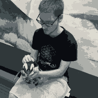

# About
ColorConverter is a simple program that was designed to help with adjusting the color palette of some assets that are used in Orionis. The 
    program takes a series of RGBA values that denotes a color palette and uses this palette to convert the color of the pixels in the images 
    passed to the program. The specific color is chosen based on the relative brightness, so the color in the palette with the closest brightness 
    to the color of the current pixel will be chosen.

## Compiling
ColorConverter is programmed using the [Haxe Toolkit](https://haxe.org). The given `Build.hxml` will compile to a Java target, but this can be 
    changed to suit your preference. However, depending on your target, some changes to `ColorConverter.hx` might be necessary.

## Running
Upon compiling, a folder named `java` will be created. You can run ColorConverter by typing `java -jar java/ColorConverter ...` where `...` are 
    the arguments to ColorConverter. Use `-h` to see a description of all options.

_An image before being ran through ColorConverter_

_The same image after being ran through ColorConverter using a palette of greys_

`java -jar java/ColorConverter.jar "10 12 17 255, 48 56 58 255, 68 79 81 255, 102 109 112 255, 145 150 147 255, 173 175 170 255, 209 206 198 255, 
    221 219 209 255" Before.png` was the command used to produce the above image.
